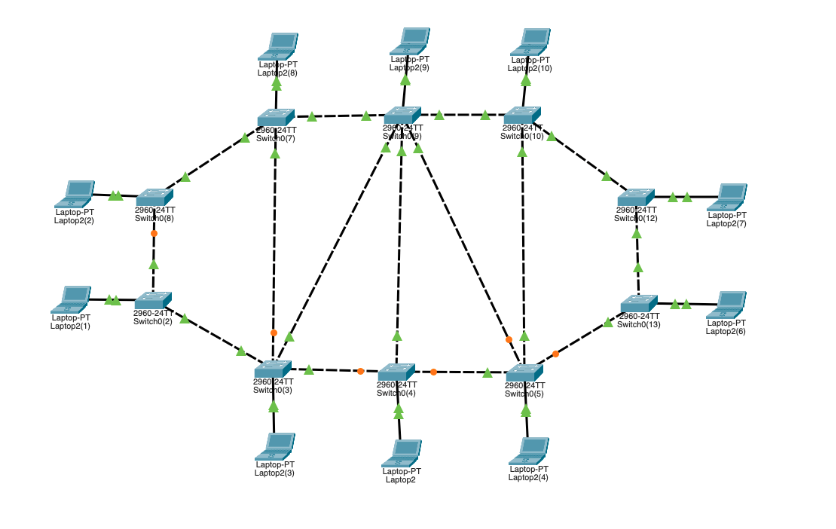
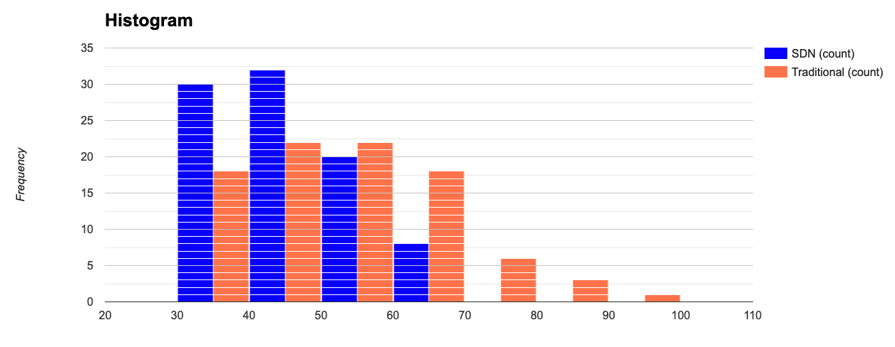

# Custom Network Comparison

Connecting 10 switches on the following topology, each one with a single host connection. All connections delay set to `5ms`;



### SDN - Shortestest path strategy (Dijkstra)

Ping latency between hosts:

```ssh
*** Ping: testing ping reachability
h1 -> h2 h3 h4 h5 h6 h7 h8 h9 h10
h2 -> h1 h3 h4 h5 h6 h7 h8 h9 h10
h3 -> h1 h2 h4 h5 h6 h7 h8 h9 h10
h4 -> h1 h2 h3 h5 h6 h7 h8 h9 h10
h5 -> h1 h2 h3 h4 h6 h7 h8 h9 h10
h6 -> h1 h2 h3 h4 h5 h7 h8 h9 h10
h7 -> h1 h2 h3 h4 h5 h6 h8 h9 h10
h8 -> h1 h2 h3 h4 h5 h6 h7 h9 h10
h9 -> h1 h2 h3 h4 h5 h6 h7 h8 h10
h10 -> h1 h2 h3 h4 h5 h6 h7 h8 h9
*** Results:
 h1->h2: 1/1, rtt min/avg/max/mdev 47.545/47.545/47.545/0.000 ms
 h1->h3: 1/1, rtt min/avg/max/mdev 95.274/95.274/95.274/0.000 ms
 h1->h4: 1/1, rtt min/avg/max/mdev 95.853/95.853/95.853/0.000 ms
 h1->h5: 1/1, rtt min/avg/max/mdev 76.322/76.322/76.322/0.000 ms
 h1->h6: 1/1, rtt min/avg/max/mdev 23.442/23.442/23.442/0.000 ms
 h1->h7: 1/1, rtt min/avg/max/mdev 63.532/63.532/63.532/0.000 ms
 h1->h8: 1/1, rtt min/avg/max/mdev 60.722/60.722/60.722/0.000 ms
 h1->h9: 1/1, rtt min/avg/max/mdev 66.312/66.312/66.312/0.000 ms
 h1->h10: 1/1, rtt min/avg/max/mdev 63.510/63.510/63.510/0.000 ms
 h2->h1: 1/1, rtt min/avg/max/mdev 0.396/0.396/0.396/0.000 ms
 h2->h3: 1/1, rtt min/avg/max/mdev 73.824/73.824/73.824/0.000 ms
 h2->h4: 1/1, rtt min/avg/max/mdev 24.907/24.907/24.907/0.000 ms
 h2->h5: 1/1, rtt min/avg/max/mdev 127.103/127.103/127.103/0.000 ms
 h2->h6: 1/1, rtt min/avg/max/mdev 38.538/38.538/38.538/0.000 ms
 h2->h7: 1/1, rtt min/avg/max/mdev 51.669/51.669/51.669/0.000 ms
 h2->h8: 1/1, rtt min/avg/max/mdev 53.983/53.983/53.983/0.000 ms
 h2->h9: 1/1, rtt min/avg/max/mdev 36.502/36.502/36.502/0.000 ms
 h2->h10: 1/1, rtt min/avg/max/mdev 96.190/96.190/96.190/0.000 ms
 h3->h1: 1/1, rtt min/avg/max/mdev 0.223/0.223/0.223/0.000 ms
 h3->h2: 1/1, rtt min/avg/max/mdev 0.044/0.044/0.044/0.000 ms
 h3->h4: 1/1, rtt min/avg/max/mdev 28.446/28.446/28.446/0.000 ms
 h3->h5: 1/1, rtt min/avg/max/mdev 92.899/92.899/92.899/0.000 ms
 h3->h6: 1/1, rtt min/avg/max/mdev 61.883/61.883/61.883/0.000 ms
 h3->h7: 1/1, rtt min/avg/max/mdev 48.685/48.685/48.685/0.000 ms
 h3->h8: 1/1, rtt min/avg/max/mdev 95.557/95.557/95.557/0.000 ms
 h3->h9: 1/1, rtt min/avg/max/mdev 84.800/84.800/84.800/0.000 ms
 h3->h10: 1/1, rtt min/avg/max/mdev 28.611/28.611/28.611/0.000 ms
 h4->h1: 1/1, rtt min/avg/max/mdev 0.197/0.197/0.197/0.000 ms
 h4->h2: 1/1, rtt min/avg/max/mdev 0.049/0.049/0.049/0.000 ms
 h4->h3: 1/1, rtt min/avg/max/mdev 0.051/0.051/0.051/0.000 ms
 h4->h5: 1/1, rtt min/avg/max/mdev 131.097/131.097/131.097/0.000 ms
 h4->h6: 1/1, rtt min/avg/max/mdev 38.462/38.462/38.462/0.000 ms
 h4->h7: 1/1, rtt min/avg/max/mdev 58.012/58.012/58.012/0.000 ms
 h4->h8: 1/1, rtt min/avg/max/mdev 62.770/62.770/62.770/0.000 ms
 h4->h9: 1/1, rtt min/avg/max/mdev 50.365/50.365/50.365/0.000 ms
 h4->h10: 1/1, rtt min/avg/max/mdev 90.607/90.607/90.607/0.000 ms
 h5->h1: 1/1, rtt min/avg/max/mdev 0.348/0.348/0.348/0.000 ms
 h5->h2: 1/1, rtt min/avg/max/mdev 0.041/0.041/0.041/0.000 ms
 h5->h3: 1/1, rtt min/avg/max/mdev 0.175/0.175/0.175/0.000 ms
 h5->h4: 1/1, rtt min/avg/max/mdev 0.067/0.067/0.067/0.000 ms
 h5->h6: 1/1, rtt min/avg/max/mdev 21.699/21.699/21.699/0.000 ms
 h5->h7: 1/1, rtt min/avg/max/mdev 125.010/125.010/125.010/0.000 ms
 h5->h8: 1/1, rtt min/avg/max/mdev 26.156/26.156/26.156/0.000 ms
 h5->h9: 1/1, rtt min/avg/max/mdev 93.684/93.684/93.684/0.000 ms
 h5->h10: 1/1, rtt min/avg/max/mdev 63.423/63.423/63.423/0.000 ms
 h6->h1: 1/1, rtt min/avg/max/mdev 0.175/0.175/0.175/0.000 ms
 h6->h2: 1/1, rtt min/avg/max/mdev 0.035/0.035/0.035/0.000 ms
 h6->h3: 1/1, rtt min/avg/max/mdev 0.035/0.035/0.035/0.000 ms
 h6->h4: 1/1, rtt min/avg/max/mdev 0.036/0.036/0.036/0.000 ms
 h6->h5: 1/1, rtt min/avg/max/mdev 0.033/0.033/0.033/0.000 ms
 h6->h7: 1/1, rtt min/avg/max/mdev 65.017/65.017/65.017/0.000 ms
 h6->h8: 1/1, rtt min/avg/max/mdev 44.669/44.669/44.669/0.000 ms
 h6->h9: 1/1, rtt min/avg/max/mdev 101.661/101.661/101.661/0.000 ms
 h6->h10: 1/1, rtt min/avg/max/mdev 87.164/87.164/87.164/0.000 ms
 h7->h1: 1/1, rtt min/avg/max/mdev 0.281/0.281/0.281/0.000 ms
 h7->h2: 1/1, rtt min/avg/max/mdev 0.046/0.046/0.046/0.000 ms
 h7->h3: 1/1, rtt min/avg/max/mdev 0.098/0.098/0.098/0.000 ms
 h7->h4: 1/1, rtt min/avg/max/mdev 0.070/0.070/0.070/0.000 ms
 h7->h5: 1/1, rtt min/avg/max/mdev 0.061/0.061/0.061/0.000 ms
 h7->h6: 1/1, rtt min/avg/max/mdev 0.036/0.036/0.036/0.000 ms
 h7->h8: 1/1, rtt min/avg/max/mdev 70.975/70.975/70.975/0.000 ms
 h7->h9: 1/1, rtt min/avg/max/mdev 44.440/44.440/44.440/0.000 ms
 h7->h10: 1/1, rtt min/avg/max/mdev 122.389/122.389/122.389/0.000 ms
 h8->h1: 1/1, rtt min/avg/max/mdev 0.303/0.303/0.303/0.000 ms
 h8->h2: 1/1, rtt min/avg/max/mdev 0.036/0.036/0.036/0.000 ms
 h8->h3: 1/1, rtt min/avg/max/mdev 0.048/0.048/0.048/0.000 ms
 h8->h4: 1/1, rtt min/avg/max/mdev 0.064/0.064/0.064/0.000 ms
 h8->h5: 1/1, rtt min/avg/max/mdev 0.061/0.061/0.061/0.000 ms
 h8->h6: 1/1, rtt min/avg/max/mdev 0.043/0.043/0.043/0.000 ms
 h8->h7: 1/1, rtt min/avg/max/mdev 0.193/0.193/0.193/0.000 ms
 h8->h9: 1/1, rtt min/avg/max/mdev 16.423/16.423/16.423/0.000 ms
 h8->h10: 1/1, rtt min/avg/max/mdev 105.055/105.055/105.055/0.000 ms
 h9->h1: 1/1, rtt min/avg/max/mdev 0.371/0.371/0.371/0.000 ms
 h9->h2: 1/1, rtt min/avg/max/mdev 0.112/0.112/0.112/0.000 ms
 h9->h3: 1/1, rtt min/avg/max/mdev 0.062/0.062/0.062/0.000 ms
 h9->h4: 1/1, rtt min/avg/max/mdev 0.061/0.061/0.061/0.000 ms
 h9->h5: 1/1, rtt min/avg/max/mdev 0.059/0.059/0.059/0.000 ms
 h9->h6: 1/1, rtt min/avg/max/mdev 0.050/0.050/0.050/0.000 ms
 h9->h7: 1/1, rtt min/avg/max/mdev 0.048/0.048/0.048/0.000 ms
 h9->h8: 1/1, rtt min/avg/max/mdev 0.054/0.054/0.054/0.000 ms
 h9->h10: 1/1, rtt min/avg/max/mdev 25.391/25.391/25.391/0.000 ms
 h10->h1: 1/1, rtt min/avg/max/mdev 0.228/0.228/0.228/0.000 ms
 h10->h2: 1/1, rtt min/avg/max/mdev 0.055/0.055/0.055/0.000 ms
 h10->h3: 1/1, rtt min/avg/max/mdev 0.084/0.084/0.084/0.000 ms
 h10->h4: 1/1, rtt min/avg/max/mdev 0.085/0.085/0.085/0.000 ms
 h10->h5: 1/1, rtt min/avg/max/mdev 0.047/0.047/0.047/0.000 ms
 h10->h6: 1/1, rtt min/avg/max/mdev 0.076/0.076/0.076/0.000 ms
 h10->h7: 1/1, rtt min/avg/max/mdev 0.114/0.114/0.114/0.000 ms
 h10->h8: 1/1, rtt min/avg/max/mdev 0.055/0.055/0.055/0.000 ms
 h10->h9: 1/1, rtt min/avg/max/mdev 0.039/0.039/0.039/0.000 ms
```


- **Mean**: 43.7304
- **Standard Deviation**: 10.561012
- **Variance**: 111.53498


### Traditional Network (STP Enabled)

Running ping command from 

```
*** Ping: testing ping reachability
h1 -> h2 h3 h4 h5 h6 h7 h8 h9 h10
h2 -> h1 h3 h4 h5 h6 h7 h8 h9 h10
h3 -> h1 h2 h4 h5 h6 h7 h8 h9 h10
h4 -> h1 h2 h3 h5 h6 h7 h8 h9 h10
h5 -> h1 h2 h3 h4 h6 h7 h8 h9 h10
h6 -> h1 h2 h3 h4 h5 h7 h8 h9 h10
h7 -> h1 h2 h3 h4 h5 h6 h8 h9 h10
h8 -> h1 h2 h3 h4 h5 h6 h7 h9 h10
h9 -> h1 h2 h3 h4 h5 h6 h7 h8 h10
h10 -> h1 h2 h3 h4 h5 h6 h7 h8 h9
*** Results:
 h1->h2: 1/1, rtt min/avg/max/mdev 0.055/0.055/0.055/0.000 ms
 h1->h3: 1/1, rtt min/avg/max/mdev 0.045/0.045/0.045/0.000 ms
 h1->h4: 1/1, rtt min/avg/max/mdev 0.048/0.048/0.048/0.000 ms
 h1->h5: 1/1, rtt min/avg/max/mdev 0.057/0.057/0.057/0.000 ms
 h1->h6: 1/1, rtt min/avg/max/mdev 0.056/0.056/0.056/0.000 ms
 h1->h7: 1/1, rtt min/avg/max/mdev 0.053/0.053/0.053/0.000 ms
 h1->h8: 1/1, rtt min/avg/max/mdev 0.051/0.051/0.051/0.000 ms
 h1->h9: 1/1, rtt min/avg/max/mdev 0.070/0.070/0.070/0.000 ms
 h1->h10: 1/1, rtt min/avg/max/mdev 0.075/0.075/0.075/0.000 ms
 h2->h1: 1/1, rtt min/avg/max/mdev 0.047/0.047/0.047/0.000 ms
 h2->h3: 1/1, rtt min/avg/max/mdev 0.043/0.043/0.043/0.000 ms
 h2->h4: 1/1, rtt min/avg/max/mdev 0.126/0.126/0.126/0.000 ms
 h2->h5: 1/1, rtt min/avg/max/mdev 0.068/0.068/0.068/0.000 ms
 h2->h6: 1/1, rtt min/avg/max/mdev 0.059/0.059/0.059/0.000 ms
 h2->h7: 1/1, rtt min/avg/max/mdev 0.105/0.105/0.105/0.000 ms
 h2->h8: 1/1, rtt min/avg/max/mdev 0.087/0.087/0.087/0.000 ms
 h2->h9: 1/1, rtt min/avg/max/mdev 0.060/0.060/0.060/0.000 ms
 h2->h10: 1/1, rtt min/avg/max/mdev 0.066/0.066/0.066/0.000 ms
 h3->h1: 1/1, rtt min/avg/max/mdev 0.065/0.065/0.065/0.000 ms
 h3->h2: 1/1, rtt min/avg/max/mdev 0.076/0.076/0.076/0.000 ms
 h3->h4: 1/1, rtt min/avg/max/mdev 0.050/0.050/0.050/0.000 ms
 h3->h5: 1/1, rtt min/avg/max/mdev 0.104/0.104/0.104/0.000 ms
 h3->h6: 1/1, rtt min/avg/max/mdev 0.065/0.065/0.065/0.000 ms
 h3->h7: 1/1, rtt min/avg/max/mdev 0.132/0.132/0.132/0.000 ms
 h3->h8: 1/1, rtt min/avg/max/mdev 0.214/0.214/0.214/0.000 ms
 h3->h9: 1/1, rtt min/avg/max/mdev 0.259/0.259/0.259/0.000 ms
 h3->h10: 1/1, rtt min/avg/max/mdev 0.209/0.209/0.209/0.000 ms
 h4->h1: 1/1, rtt min/avg/max/mdev 0.193/0.193/0.193/0.000 ms
 h4->h2: 1/1, rtt min/avg/max/mdev 0.070/0.070/0.070/0.000 ms
 h4->h3: 1/1, rtt min/avg/max/mdev 0.059/0.059/0.059/0.000 ms
 h4->h5: 1/1, rtt min/avg/max/mdev 0.200/0.200/0.200/0.000 ms
 h4->h6: 1/1, rtt min/avg/max/mdev 0.067/0.067/0.067/0.000 ms
 h4->h7: 1/1, rtt min/avg/max/mdev 0.060/0.060/0.060/0.000 ms
 h4->h8: 1/1, rtt min/avg/max/mdev 0.047/0.047/0.047/0.000 ms
 h4->h9: 1/1, rtt min/avg/max/mdev 0.095/0.095/0.095/0.000 ms
 h4->h10: 1/1, rtt min/avg/max/mdev 0.048/0.048/0.048/0.000 ms
 h5->h1: 1/1, rtt min/avg/max/mdev 0.193/0.193/0.193/0.000 ms
 h5->h2: 1/1, rtt min/avg/max/mdev 0.139/0.139/0.139/0.000 ms
 h5->h3: 1/1, rtt min/avg/max/mdev 0.199/0.199/0.199/0.000 ms
 h5->h4: 1/1, rtt min/avg/max/mdev 0.067/0.067/0.067/0.000 ms
 h5->h6: 1/1, rtt min/avg/max/mdev 0.031/0.031/0.031/0.000 ms
 h5->h7: 1/1, rtt min/avg/max/mdev 0.038/0.038/0.038/0.000 ms
 h5->h8: 1/1, rtt min/avg/max/mdev 0.133/0.133/0.133/0.000 ms
 h5->h9: 1/1, rtt min/avg/max/mdev 0.125/0.125/0.125/0.000 ms
 h5->h10: 1/1, rtt min/avg/max/mdev 0.121/0.121/0.121/0.000 ms
 h6->h1: 1/1, rtt min/avg/max/mdev 0.053/0.053/0.053/0.000 ms
 h6->h2: 1/1, rtt min/avg/max/mdev 0.165/0.165/0.165/0.000 ms
 h6->h3: 1/1, rtt min/avg/max/mdev 0.059/0.059/0.059/0.000 ms
 h6->h4: 1/1, rtt min/avg/max/mdev 0.053/0.053/0.053/0.000 ms
 h6->h5: 1/1, rtt min/avg/max/mdev 0.037/0.037/0.037/0.000 ms
 h6->h7: 1/1, rtt min/avg/max/mdev 0.031/0.031/0.031/0.000 ms
 h6->h8: 1/1, rtt min/avg/max/mdev 0.044/0.044/0.044/0.000 ms
 h6->h9: 1/1, rtt min/avg/max/mdev 0.060/0.060/0.060/0.000 ms
 h6->h10: 1/1, rtt min/avg/max/mdev 0.062/0.062/0.062/0.000 ms
 h7->h1: 1/1, rtt min/avg/max/mdev 0.054/0.054/0.054/0.000 ms
 h7->h2: 1/1, rtt min/avg/max/mdev 0.125/0.125/0.125/0.000 ms
 h7->h3: 1/1, rtt min/avg/max/mdev 0.044/0.044/0.044/0.000 ms
 h7->h4: 1/1, rtt min/avg/max/mdev 0.044/0.044/0.044/0.000 ms
 h7->h5: 1/1, rtt min/avg/max/mdev 0.048/0.048/0.048/0.000 ms
 h7->h6: 1/1, rtt min/avg/max/mdev 0.056/0.056/0.056/0.000 ms
 h7->h8: 1/1, rtt min/avg/max/mdev 0.051/0.051/0.051/0.000 ms
 h7->h9: 1/1, rtt min/avg/max/mdev 0.058/0.058/0.058/0.000 ms
 h7->h10: 1/1, rtt min/avg/max/mdev 0.045/0.045/0.045/0.000 ms
 h8->h1: 1/1, rtt min/avg/max/mdev 0.032/0.032/0.032/0.000 ms
 h8->h2: 1/1, rtt min/avg/max/mdev 0.121/0.121/0.121/0.000 ms
 h8->h3: 1/1, rtt min/avg/max/mdev 0.074/0.074/0.074/0.000 ms
 h8->h4: 1/1, rtt min/avg/max/mdev 0.066/0.066/0.066/0.000 ms
 h8->h5: 1/1, rtt min/avg/max/mdev 0.176/0.176/0.176/0.000 ms
 h8->h6: 1/1, rtt min/avg/max/mdev 0.095/0.095/0.095/0.000 ms
 h8->h7: 1/1, rtt min/avg/max/mdev 0.039/0.039/0.039/0.000 ms
 h8->h9: 1/1, rtt min/avg/max/mdev 0.058/0.058/0.058/0.000 ms
 h8->h10: 1/1, rtt min/avg/max/mdev 0.062/0.062/0.062/0.000 ms
 h9->h1: 1/1, rtt min/avg/max/mdev 0.062/0.062/0.062/0.000 ms
 h9->h2: 1/1, rtt min/avg/max/mdev 0.185/0.185/0.185/0.000 ms
 h9->h3: 1/1, rtt min/avg/max/mdev 0.052/0.052/0.052/0.000 ms
 h9->h4: 1/1, rtt min/avg/max/mdev 0.067/0.067/0.067/0.000 ms
 h9->h5: 1/1, rtt min/avg/max/mdev 0.136/0.136/0.136/0.000 ms
 h9->h6: 1/1, rtt min/avg/max/mdev 0.062/0.062/0.062/0.000 ms
 h9->h7: 1/1, rtt min/avg/max/mdev 0.063/0.063/0.063/0.000 ms
 h9->h8: 1/1, rtt min/avg/max/mdev 0.039/0.039/0.039/0.000 ms
 h9->h10: 1/1, rtt min/avg/max/mdev 0.042/0.042/0.042/0.000 ms
 h10->h1: 1/1, rtt min/avg/max/mdev 0.111/0.111/0.111/0.000 ms
 h10->h2: 1/1, rtt min/avg/max/mdev 0.190/0.190/0.190/0.000 ms
 h10->h3: 1/1, rtt min/avg/max/mdev 0.069/0.069/0.069/0.000 ms
 h10->h4: 1/1, rtt min/avg/max/mdev 0.072/0.072/0.072/0.000 ms
 h10->h5: 1/1, rtt min/avg/max/mdev 0.093/0.093/0.093/0.000 ms
 h10->h6: 1/1, rtt min/avg/max/mdev 0.069/0.069/0.069/0.000 ms
 h10->h7: 1/1, rtt min/avg/max/mdev 0.069/0.069/0.069/0.000 ms
 h10->h8: 1/1, rtt min/avg/max/mdev 0.066/0.066/0.066/0.000 ms
 h10->h9: 1/1, rtt min/avg/max/mdev 0.058/0.058/0.058/0.000 ms
```

- **Mean**: 52.921789
- **Standard Deviation**: 15.263892
- **Variance**: 232.98639


> Latency Frequency Histogram - Comparison (ms)



<sub>
Authored by Victor Tostes - UFMG
</sub>
