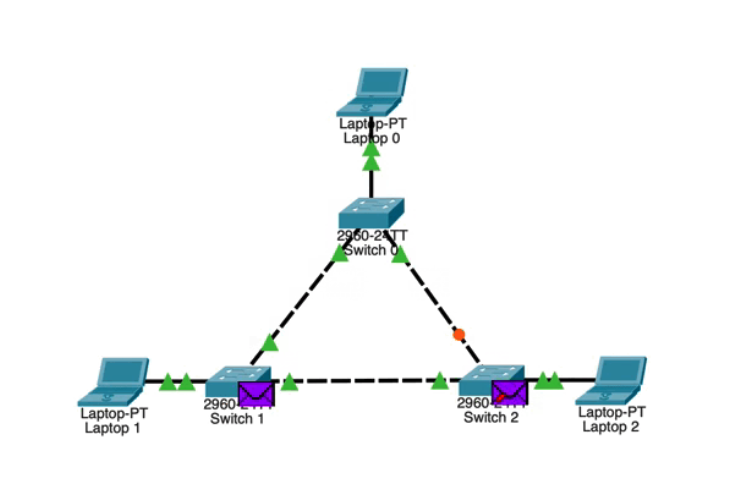
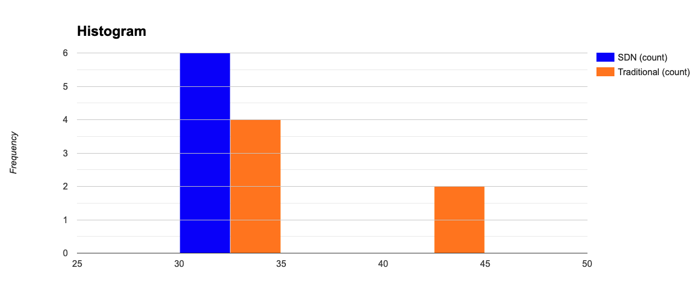

# Triangular Network Comparison

Connecting 3 switches on loop topology, each one with a single host connection. All connections delay set to `5ms`;



### SDN - Shortestest path strategy (Dijksta)

Ping latency between hosts:

```ssh
*** Ping: testing ping reachability
h1 -> h2 h3
h2 -> h1 h3
h3 -> h1 h2
*** Results:
 h1->h2: 1/1, rtt min/avg/max/mdev 32.209/32.209/32.209/0.000 ms
 h1->h3: 1/1, rtt min/avg/max/mdev 30.760/30.760/30.760/0.000 ms
 h2->h1: 1/1, rtt min/avg/max/mdev 31.701/31.701/31.701/0.000 ms
 h2->h3: 1/1, rtt min/avg/max/mdev 30.988/30.988/30.988/0.000 ms
 h3->h1: 1/1, rtt min/avg/max/mdev 34.369/34.369/34.369/0.000 ms
 h3->h2: 1/1, rtt min/avg/max/mdev 32.636/32.636/32.636/0.000 ms
```


- **Mean**: 32.1105
- **Standard Deviation**: 1.3143988
- **Variance**: 1.7276443


### Traditional Network (STP Enabled)

Running ping command from 

```
*** Ping: testing ping reachability
h1 -> h2 h3
h2 -> h1 h3
h3 -> h1 h2
*** Results:
 h1->h2: 1/1, rtt min/avg/max/mdev 31.527/31.527/31.527/0.000 ms
 h1->h3: 1/1, rtt min/avg/max/mdev 43.469/43.469/43.469/0.000 ms
 h2->h1: 1/1, rtt min/avg/max/mdev 30.878/30.878/30.878/0.000 ms
 h2->h3: 1/1, rtt min/avg/max/mdev 31.916/31.916/31.916/0.000 ms
 h3->h1: 1/1, rtt min/avg/max/mdev 42.541/42.541/42.541/0.000 ms
 h3->h2: 1/1, rtt min/avg/max/mdev 32.939/32.939/32.939/0.000 ms
```

- **Mean**: 35.545
- **Standard Deviation**: 5.8244293
- **Variance**: 33.923976


> Latency Frequency Histogram - Comparison (ms)



<sub>
Authored by Victor Tostes - UFMG
</sub>
